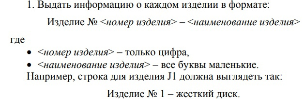

## Запросы к лабе намбер ту



```
SELECT 'Изделие №'|| Substr(n_izd,2,1)||' - '||lower(name)
FROM j


substr - строковая функция, которая берет строку(в нашем случае например J1), дальше пишем позицию, которую хотим получить(ну в смысле с какой позиции), и длину получаемой строки

lower - маленькие буквы
```

```
2.Получить номера изделий, для которых поставлялась КАЖДАЯ деталь, поставлявшаяся поставщиками с рейтингом не выше 20.
```
### Первая подзадача
```
Детали, поставлявшиеся поставщиками с рейтингом не выше 20
```
```
SELECT n_det
FROM spj
JOIN s ON spj.n_post=s.n_post
WHERE s.reiting<20
```
### Вторая подзадача

```
Для которых поставлялась КАЖДАЯ деталь(то есть типа P3 и P5 в нашем случае)
Но во всяком случае теперь будет общий запрос
```

```
SELECT spj.n_izd
FROM spj
WHERE spj.n_det in(SELECT n_det
                   FROM spj
                   JOIN s ON spj.n_post=s.n_post
                   WHERE s.reiting<=20)
GROUP BY spj.n_izd
HAVING COUNT(DISTINCT spj.n_det) = (SELECT COUNT(DISTINCT n_det)
                                    FROM spj
                                    JOIN s ON spj.n_post=s.n_post
                                    WHERE s.reiting<=20)


В общем - having это то же самое что и вхере, только уже для сгруппированных выборок
```

```
GRANT usage --для пользования
ON SCHEMA pmib1303 -- имя схемы
TO "pmi-b1203" --имя пользователя

```