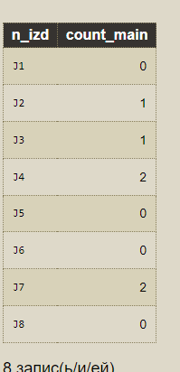
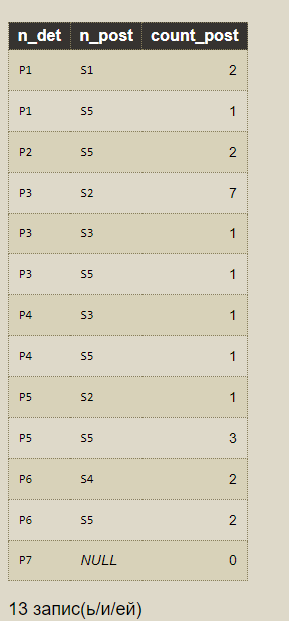

## Запрос номер 1
```
Получить наибольший объем поставки для каждого изделия и найти их среднее.
```
```
1) Получить наибольший объем поставки для каждого изделия
```
```
select n_izd, max(kol)
from spj
group by n_izd
```
```
2)Найти среднее из той поставки
```
```
select avg(a.max)
from (select n_izd, max(kol)
      from spj
      group by n_izd) a
```
**ВНИМАНИЕ** вроде работает, но я не уверена, что правильно - потому что:
<p>1) Изделия берем с таблицы spj, а в этом случае(если у нас есть изделие, для которого не делали поставки) это изделие не выведется
<br>Надо ли выводить из таблицы j?
<br> Хотя, в методе сделано так

## Запрос номер 2

```
Для указанного поставщика S* найти средний объем его поставок для каждого из изделий (для которых он поставлял детали). Вывести номер изделия, название изделия, город изделия, средний объем поставок для изделия. 
```
```
1)Найти средний объем поставок(какого-то поставщика) для каждого из изделий(для которых он поставлял детали)
```
```
select spj.n_izd, avg(kol)
from spj
where spj.n_post = 'S1'
group by spj.n_izd
```
```
2) Теперб выводим все что нужно
```
```
select j.n_izd, j.name, j.town,a.средний_объем_поставки
from (select spj.n_izd, avg(kol) as средний_объем_поставки
      from spj
      where spj.n_post = 'S*'
      group by spj.n_izd) a
join j on j.n_izd=a.n_izd
```
**Этот должен быть правильным**

## Запрос номер 3

```
Ввести номер изделия J*. Найти цвета деталей, поставлявшихся для изделия J*, и определить, какой процент поставки деталей каждого цвета составляют от общего числа поставок для изделия. Вывести цвет детали, число поставок деталей этого цвета, общее число поставок для изделия J*, процент.
```
```
1)Найдем цвета, которые поставляются для изделия J*
```
```
select distinct p.cvet
from spj
join p on p.n_det=spj.n_det
where spj.n_izd = 'J1'
```
```
2)Получим общее число поставок для этого изделия
```
```
select count(n_izd) as общее_число_поставок
from spj
where spj.n_izd = 'J1'
```
```
3) Теперь слегка модифицируем задачу 1, посчитаем кол-во поставок этого цвета
```
```
select p.cvet, count(spj.n_izd)
from spj
join p on p.n_det=spj.n_det
where spj.n_izd = 'J1'
group by p.cvet
```
```
select a.cvet, a.количество_пост_этого_цвета, b.общее_число_поставок,
 round(a.количество_пост_этого_цвета*100.0/b.общее_число_поставок,2) pr
from (select p.cvet as cvet, count(spj.n_izd) as количество_пост_этого_цвета
      from spj
      join p on p.n_det=spj.n_det
      where spj.n_izd = 'J7'
      group by p.cvet) a
cross join (select count(n_izd) as общее_число_поставок
            from spj
            where spj.n_izd = 'J7') b
```


```
Запрос на защиту
```
```
какой-то результат
```
```
select post.n_post, max(mx.weneed)
from (select spj.n_post, max(spj.kol*p.ves) as weneed
      from spj
      join p on p.n_det=spj.n_det
      where spj.n_izd = 'J1'
      group by spj.n_post) mx
group by mx.
```
```
1)Выбрать поставщиков, выполнивших для какого-то(в нашем случае) изделия наибольшую по весу поставку 
```
```

```
```

select t2.n_izd, t3.n_post, t2.mx
from (select t1.n_izd, max(t1.weneed) as mx
      from (select spj.n_izd, spj.n_post, max(spj.kol*p.ves) as weneed
            from spj
            join p on p.n_det=spj.n_det
            group by spj.n_izd, spj.n_post
            order by spj.n_izd, spj.n_post) t1
      group by n_izd) t2
join (select j.n_izd, spj.n_post, max(spj.kol*p.ves) as weneed
            from spj
            join p on p.n_det=spj.n_det
            join j on j.n_izd = j.n_izd
            group by j.n_izd, spj.n_post
            order by j.n_izd, spj.n_post) t3 on t3.n_izd = t2.n_izd
where t2.mx=t3.weneed
order by t2.n_izd, t3.n_post
```
```
t1 - запрос, получающий максимальный рейтинг, t2 - дает, то, что нужно
```нашла ошибку, во втором join выводит максимальный для поставщика```
```

## Запросы на защиту


```
SELECT DISTINCT j.town, s.n_post, s.reiting AS maxr 
from j  
join (SELECT DISTINCT j.town, s.n_post, s.reiting AS maxr 
    FROM spj 
    JOIN j ON j.n_izd=spj.n_izd 
    JOIN s ON s.n_post = spj.n_post 
    WHERE (j.town, s.reiting) IN ( 
        SELECT j.town, MAX(s.reiting) 
        FROM spj 
        RIGHT JOIN j ON spj.n_izd = j.n_izd 
        JOIN s ON s.n_post = spj.n_post 
        GROUP BY j.town 
    ) ORDER BY j.town, s.n_post 
)table1 on j.town = table1.town
```


### ЧАСТЬ ЗАПРОСА
```
SELECT j.n_izd, spj.n_post, MAX(spj.kol * p.ves) AS weneed
FROM j
LEFT JOIN spj ON j.n_izd = spj.n_izd
LEFT JOIN p ON p.n_det = spj.n_det
GROUP BY j.n_izd, spj.n_post
ORDER BY j.n_izd, spj.n_post

```

SELECT DISTINCT a.n_izd, b.n_post, a.weneed
FROM (SELECT j.n_izd,MAX(spj.kol * p.ves) AS weneed
      FROM j
      LEFT JOIN spj ON j.n_izd = spj.n_izd
      LEFT JOIN p ON p.n_det = spj.n_det
      GROUP BY j.n_izd
      ORDER BY j.n_izd) a
left join (select spj.n_post, MAX(spj.kol*p.ves) AS maxp
           from spj
           join p ON spj.n_det = p.n_det
           group by spj.n_post) b on b.maxp=a.weneed
order by a.n_izd

SELECT DISTINCT a.n_izd, b.n_post, a.weneed
FROM (SELECT j.n_izd,MAX(spj.kol * p.ves) AS weneed
      FROM j
      LEFT JOIN spj ON j.n_izd = spj.n_izd
      LEFT JOIN p ON p.n_det = spj.n_det
      GROUP BY j.n_izd
      ORDER BY j.n_izd) a
left join (select distinct spj.n_izd, spj.n_post, max(spj.kol*p.ves) as maxp
            from spj
            join p on p.n_det=spj.n_det
            group by spj.n_izd, spj.n_post
            order by spj.n_izd, spj.n_post) b on (b.maxp=a.weneed and b.n_izd = a.n_izd)
order by a.n_izd


```
1)Для каждого изделия определить число поставщиков, для котрых изделия является основным, то есть будет являться изделием, для которого поставщик сделал больше всего поставок
```
```
SELECT j.n_izd,
 COUNT(DISTINCT s.n_post) AS num_main_suppliersFROM j
LEFT JOIN spj ON j.n_izd = spj.n_izd
LEFT JOIN ( SELECT
  n_post,  MAX(kol) AS max_kol,
  MAX(CASE WHEN town = s.town THEN kol END) AS max_kol_in_town,  MAX(CASE WHEN town = s.town THEN name END) AS max_name_in_town
 FROM spj JOIN s
  ON spj.n_post = s.n_post GROUP BY
  n_post) AS max_suppliers
 ON spj.n_post = max_suppliers.n_post AND spj.n_izd = max_suppliers.max_name_in_town
 AND spj.kol = max_suppliers.max_kol_in_town AND spj.kol = max_suppliers.max_kol
LEFT JOIN s ON spj.n_post = s.n_post
GROUP BY
 j.n_izd;
```
```
Первый запрос - поставщик и его наибольший объем поставки
```

```
SELECT spj.n_post,MAX(spj.kol) AS maxp
      FROM spj
      GROUP BY spj.n_post
      ORDER BY spj.n_post
```
```
Определить, изделие и поставку для него
```

```
select distinct spj.n_izd, spj.n_post, max(spj.kol) as maxp
            from spj
            group by spj.n_izd, spj.n_post
            order by spj.n_izd, spj.n_post
```
```
Для каждого поставщика его максимальную поставку и изделие
```
Select b.n_izd, a.n_post, a.maxp
from (SELECT spj.n_post,MAX(spj.kol) AS maxp
      FROM spj
      GROUP BY spj.n_post
      ORDER BY spj.n_post) a
left join (select distinct spj.n_izd, spj.n_post, max(spj.kol) as maxp
            from spj
            group by spj.n_izd, spj.n_post
            order by spj.n_izd, spj.n_post) b on (b.maxp=a.maxp and a.n_post=b.n_post)
order by b.n_izd

```

 count(a.n_post) as count_main
```
```
select distinct c.n_izd, count(a.n_post) as count_main
from (select j.n_izd, spj.n_post, max(spj.kol) maxp
      from j
      left join spj on j.n_izd = spj.n_izd
      group by j.n_izd, spj.n_post
      order by j.n_izd, spj.n_post) c
left join (select spj.n_post,max(spj.kol) AS maxp
           from spj
           group by spj.n_post
           order by spj.n_post) a on (a.n_post=c.n_post and a.maxp=c.maxp)
group by c.n_izd
order by c.n_izd
```

```

select distinct c.n_izd, count(a.n_post) as count_main
from (select j.n_izd, spj.n_post, max(spj.kol) maxp
      from j
      left join spj on j.n_izd = spj.n_izd
      group by j.n_izd, spj.n_post
      order by j.n_izd, spj.n_post) c
left join (select spj.n_post,max(spj.kol) AS maxp
           from spj
           group by spj.n_post
           order by spj.n_post) a on (a.n_post=c.n_post and a.maxp=c.maxp)
left join (select s.n_post, s.town
           from s
           order by s.town desc
           limit 1) b on b.n_post=c.n_post
group by c.n_izd
order by c.n_izd

```
```
select distinct c.n_izd, count(a.n_post) as count_main
from (select j.n_izd, spj.n_post, max(spj.kol) maxp
      from j
      left join spj on j.n_izd = spj.n_izd
      group by j.n_izd, spj.n_post
      order by j.n_izd, spj.n_post) c
left join (select spj.n_post,max(spj.kol) AS maxp
           from spj
           group by spj.n_post
           order by spj.n_post) a on (a.n_post=c.n_post and a.maxp=c.maxp)
left join (select s.n_post,s.town 
           from spj  
           join s on s.n_post=spj.n_post
           join j on j.n_izd = spj.n_izd 
           where spj.n_izd=j.n_izd 
           order by spj.kol, s.town 
           limit 1) b on b.n_post=c.n_post
group by c.n_izd
order by c.n_izd
```


```
Для каждого города из полного списка городов определить изделие, для которого из этого города 
сделано наибольшее число поставок. Если таких изделий несколько, то взять изделие, у которого 
больше число деталей. Если и таких несколько, то первое по алфавиту. Вывести город, номер изделия и 
общий объем поставок для данного изделия из данного города.
```


```
SELECT towns.town, info.izd_num, info.total_supplies
FROM (SELECT town from s
      union
      SELECT town from p
      union
      SELECT town from j
      ORDER BY 1) towns
LEFT JOIN (SELECT j.town towns, j.n_izd izd_num, SUM(spj.kol) total_supplies
           FROM j
           JOIN spj ON j.n_izd = spj.n_izd
           GROUP BY j.town, j.n_izd
           HAVING SUM(spj.kol) = (SELECT MAX(total_inner)
                                  FROM (SELECT j.town, j.name, j.n_izd, SUM(spj.kol) total_inner
                                        FROM j
                                        JOIN spj ON j.n_izd = spj.n_izd
                                        GROUP BY j.town, j.n_izd, j.name
                                        ORDER BY j.name) subquery
                                  WHERE subquery.town = j.town
                                  ORDER BY j.town, SUM(spj.kol) DESC, j.n_izd)) info on info.towns = towns.town
ORDER BY towns.town

```

```
Для каждой детали определить поставщика, который поставил наибольшее количество деталей
```

```
Запрос, который выводит все детали, поставщиков, котрые их поставляли и то, сколько раз их поставили
```

```
select p.n_det, spj.n_post, count(spj.n_det) as count_post
from p
left join spj on p.n_det = spj.n_det
group by p.n_det, spj.n_post
order by p.n_det, spj.n_post 
```


```
select p.n_det, spj.n_post, count(spj.n_det) as count_post
from p
left join spj on p.n_det = spj.n_det
group by p.n_det, spj.n_post
having count(spj.n_det)  = (select max(count_post)
                            from (select p.n_det, spj.n_post, count(spj.n_det) as count_post
                                  from p
                                  left join spj on p.n_det = spj.n_det
                                  group by p.n_det, spj.n_post) a
                            where a.n_post = (select spj.n_post, spj.n_izd, count(spj.n_izd) as count_pozt_izd
                                              from s
                                              join spj on spj.n_post = s.n_post
                                              where )          
                           ) 
```

```
SELECT spj.n_det, spj.n_post, SUM(spj.kol) AS total_kol
FROM spj
JOIN s ON spj.n_post = s.n_post
WHERE NOT EXISTS (SELECT 1
                  FROM spj AS spj2
                  JOIN s AS s2 ON spj2.n_post = s2.n_post
                  WHERE spj2.n_det = spj.n_det
      AND (
        SUM(spj2.kol) > SUM(spj.kol)
        OR (
          SUM(spj2.kol) = SUM(spj.kol)
          AND COUNT(DISTINCT spj2.n_izd) > COUNT(DISTINCT spj.n_izd)
        )
        OR (
          SUM(spj2.kol) = SUM(spj.kol)
          AND COUNT(DISTINCT spj2.n_izd) = COUNT(DISTINCT spj.n_izd)
          AND s2.name > s.name
        )
      )
  )
GROUP BY
  spj.n_det,
  spj.n_post
ORDER BY
  spj.n_det;

```

```
select p.n_det, spj.n_post, count(spj.n_det) as count_post
from p
left join spj on p.n_det = spj.n_det
group by p.n_det, spj.n_post
having count(spj.n_det)  = (select max(a.count_post)
                            from (select p.n_det, spj.n_post, count(spj.n_det) as count_post
                                  from p
                                  left join spj on p.n_det = spj.n_det
                                  group by p.n_det, spj.n_post) a
                            where a.n_post = (select spj.n_post,  count(spj.n_izd) as count_post_izd
                                              from s
                                              join spj on spj.n_post = s.n_post
                                              where spj.n_post = (select )
                                              group by spj.n_post, s.town
                                              order by s.town desc
                                              limit 1)          
                           ) 
```

```
select p.n_det, spj.n_post, sum(spj.kol) as total_quantity
from p
left join spj on p.n_det = spj.n_det
group by p.n_det, spj.n_post
having sum(spj.kol) = (select max(total_count)
                       from (select spj.n_post, sum(spj.kol) as total_count
                             from spj
                             where spj.n_det = p.n_det
                             group by spj.n_post
                             ) as supplier_totals
                       )
and spj.n_post in (select n_post
                   from (select spj.n_post, count(spj.n_izd) as count_post_izd
                         from spj
                         where spj.n_det = p.n_det
                         group by spj.n_post
                         ) as product_counts
                   where count_post_izd = (select max(count_post_izd)
                                          from (select spj.n_post, count(spj.n_izd) as count_post_izd
                                                from spj
                                                where spj.n_det = p.n_det
                                                group by spj.n_post) as inner_counts
                                          )
)
order by p.n_det, spj.n_post desc
```

```
select p.n_det, coalesce(spj.n_post, 'Деталь не поставлялась') as n_post, coalesce(sum(spj.kol), 0) as total_quantity
from p
left join spj on p.n_det = spj.n_det
group by p.n_det, spj.n_post
having sum(spj.kol) = (select max(total_count)
                       from (select spj.n_post, sum(spj.kol) AS total_count
                             from spj
                             where spj.n_det = p.n_det
                             group by spj.n_post
                             ) as supplier_totals
                       )
OR spj.n_post is NULL
order by p.n_det, n_post desc
```

```
SELECT 
    p.n_det, 
    COALESCE(spj.n_post, 'Нет поставщика') AS n_post, 
    COALESCE(SUM(spj.kol), 0) AS total_quantity
FROM 
    p
LEFT JOIN 
    spj ON p.n_det = spj.n_det
GROUP BY 
    p.n_det, spj.n_post
HAVING 
    SUM(spj.kol) = (
        SELECT MAX(total_count)
        FROM (
            SELECT spj.n_post, SUM(spj.kol) AS total_count
            FROM spj
            WHERE spj.n_det = p.n_det
            GROUP BY spj.n_post
        ) AS supplier_totals
    )
OR spj.n_post IS NULL
ORDER BY 
    p.n_det, n_post DESC;
```

```
select t2.n_post, p.n_det, t1.vol
from (select spj.n_det, n_post, sum(kol) as vol
      from spj
      group by n_det, n_post) t1
join (select n_det, (select y.n_post --берем деталь из р, и берем у.н_пост
                     from spj y --из таблицы поставок(то есть берем поставщиков из таблицы поставок)
                     where y.n_det = p.n_det --где детали из разных таблиц совпадают
                     group by y.n_post --хз зачем пока, а ну, наверное, потому что в принципе мы группируем по ним
                     order by count(*) desc, (select count(distinct x.n_izd) --упоряд. по количеству по убыванию; получаем без повторения количество изделий
                                              from spj x --из таблицы поставок
                                              where x.n_post = y.n_post) desc, (select name --где наш поставщик с наибольшим количеством поставок, берем имя
                                                                                from s из таблицы поставщиков
                                                                                where y.n_post = s.n_post) desc --где у нас поставщик с именем последним по алфавиту
                     limit 1) --один такой поставщик
     from p) t2 on t2.n_post = t1.n_post and t2.n_det = t1.n_det
right join p on p.n_det = t2.n_det
order by 2
```
```
t1 - выводит для пары поставщик-деталь объем поставки
```

```
select spj.n_det, n_post, sum(kol) as vol
      from spj
      group by n_det, n_post
```
```
Основной запрос join - берет детали так, чтобы детали были в списке ВСЕ, группируем по деталям
```


**7-1** - оно работает

```
select j.n_izd, t2.n_post,m.name, m.reiting, t1.vol
from (select spj.n_izd, n_post, sum(kol) as vol
      from spj
      group by spj.n_izd, n_post) t1
join (select n_izd, (select y.n_post
                     from spj y
                     where y.n_izd = j.n_izd
                     group by y.n_post
                     order by count(*) desc, (select x.n_post
                                              from s x
                                              where (x.n_post = y.n_post) and (x.reiting = (select max(reiting)
                                                                                            from s))) asc, (select name
                                                                                                           from s
                                                                                                           where y.n_post = s.n_post) asc
                     limit 1)
from j) t2 on t2.n_post = t1.n_post and t2.n_izd = t1.n_izd
right join j on j.n_izd = t2.n_izd
join (select n_post, name, reiting
      from s) m on m.n_post = t2.n_post
order by 1
```

